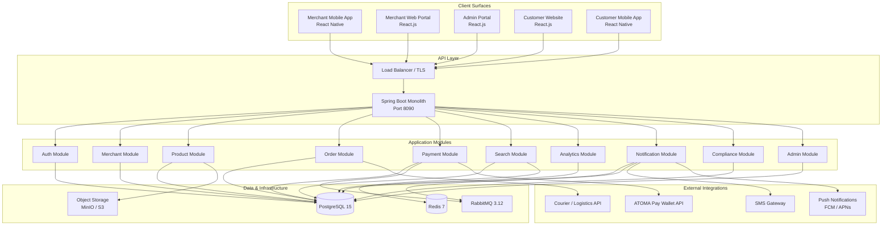
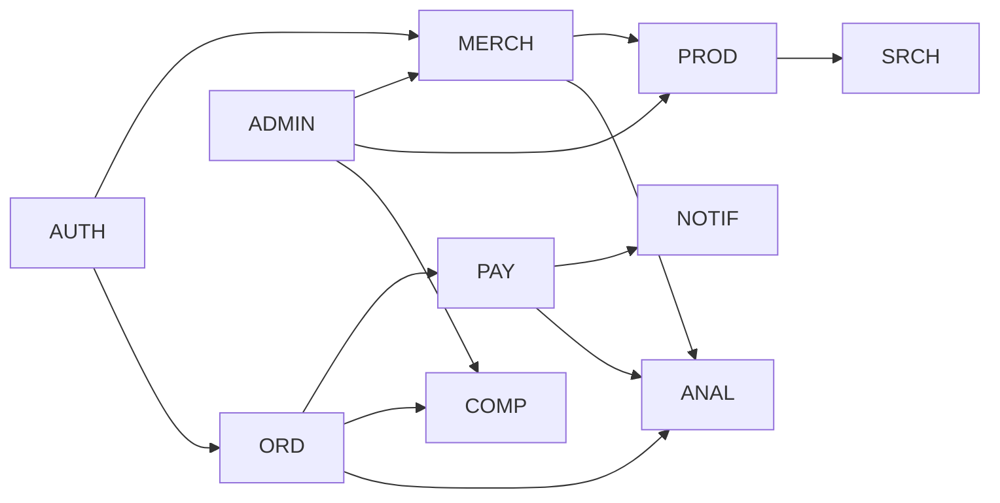
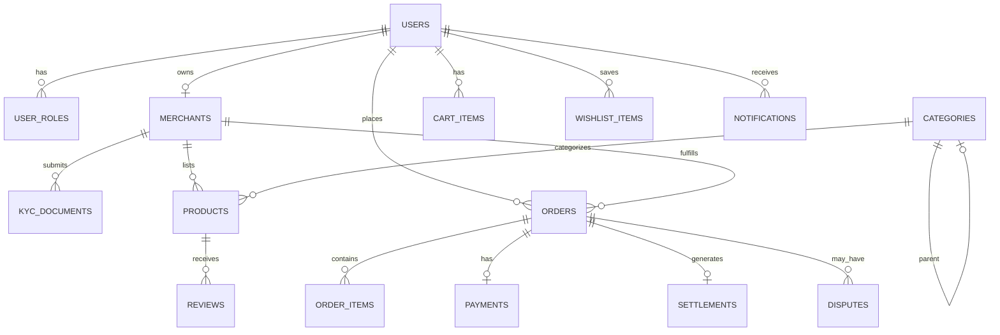
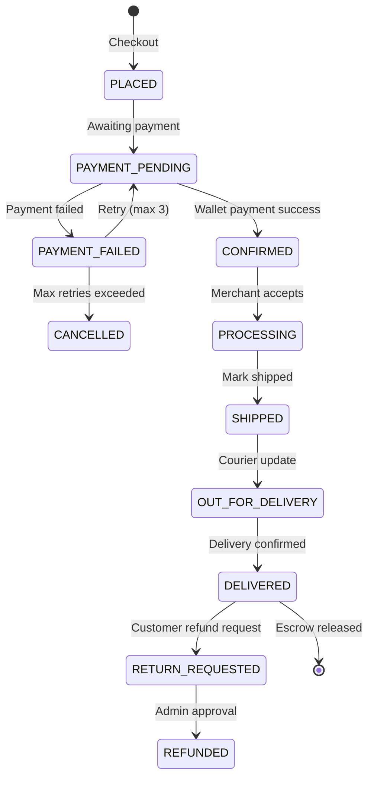
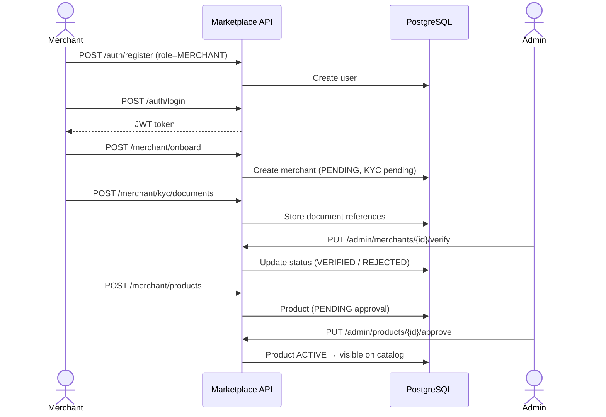
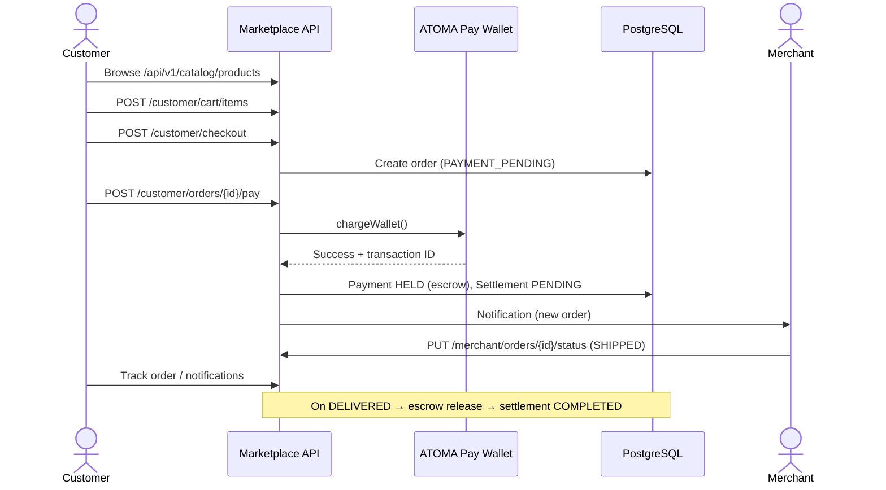

# ATOMA Pay Marketplace Platform
## Architecture Overview for Stakeholders

**Prepared for:** ATOMA (ATOMA Pay)  
**Document version:** 1.0  
**Date:** August 2026  
**Status:** Backend foundation implemented; client surfaces in phased delivery

---

## 1. Executive Summary

The ATOMA Pay Marketplace is a secure, multi-surface digital commerce platform that extends ATOMA Pay from payments into full marketplace operations. Five client applications—Merchant Mobile, Merchant Web, Admin Portal, Customer Website, and Customer Mobile—connect to **one shared backend**, ensuring real-time data consistency, unified authentication, and a seamless experience across channels.

This document describes the **technical architecture** of the platform as implemented in the current codebase, how it aligns with the six-month delivery roadmap, and how stakeholders should understand system boundaries, integrations, and deployment.

| Attribute | Detail |
|-----------|--------|
| **Architecture style** | Spring Boot monolith (single deployable backend) |
| **Deployment target** | ATOMA on-premise infrastructure |
| **Client surfaces** | 5 (Merchant Mobile, Merchant Web, Admin, Customer Web, Customer Mobile) |
| **Shared backend** | Single API, PostgreSQL database, unified JWT authentication |
| **Compliance scope** | DAB, EMI, AML/CFT hooks built into merchant onboarding and audit workflows |
| **Current backend version** | 0.1.0-SNAPSHOT |

---

## 2. Solution Context

### 2.1 Purpose

The marketplace enables:

- **Merchants** to onboard via mobile-first KYC/KYB, list products, manage orders, and receive automated settlements.
- **Customers** to browse, search, purchase via ATOMA Pay Wallet, track delivery, and request refunds.
- **ATOMA operations teams** to verify merchants, manage policies, resolve disputes, and monitor platform health.
- **Agents** (future surface integration) to support field onboarding and local operations.

### 2.2 Five Client Surfaces

All surfaces consume the same REST API. No surface maintains its own business data store.

| # | Surface | Technology | Primary users | Backend API prefix |
|---|---------|------------|---------------|-------------------|
| 1a | Merchant Mobile App | React Native (Android & iOS) | Field merchants | `/api/v1/merchant` |
| 1b | Merchant Web Portal | React.js | Merchant back-office staff | `/api/v1/merchant` |
| 2 | Admin Portal | React.js | Operations, compliance, finance | `/api/v1/admin` |
| 3 | Customer Marketplace Website | React.js | End customers (web) | `/api/v1/catalog`, `/api/v1/customer` |
| 4 | Customer Mobile App | React Native (Android & iOS) | End customers (mobile) | `/api/v1/customer` |

**Shared authentication:** All authenticated surfaces use JWT tokens issued by `/api/v1/auth`. A merchant who lists a product on mobile sees the same catalog on the customer website once admin approval completes.

---

## 3. High-Level Architecture

### 3.1 Architecture Diagram



### 3.2 Design Principles

1. **Single source of truth** — One PostgreSQL database; all surfaces read and write through the same API.
2. **Merchant-first sequencing** — Backend and merchant APIs are built first to support field onboarding before customer go-live.
3. **Modular monolith** — Business domains are separated into Java packages (not separate microservices), simplifying deployment and debugging while preserving clear boundaries.
4. **Compliance by design** — KYC/KYB workflows, audit logs, and dispute handling are first-class modules, not afterthoughts.
5. **Integration-ready** — External systems (wallet, courier, SMS) are accessed through dedicated client adapters with stub implementations for development.

---

## 4. Technology Stack

| Layer | Technology | Role |
|-------|------------|------|
| **Backend runtime** | Java 17, Spring Boot 3.4 | Core application server |
| **Web framework** | Spring Web, Spring Security | REST APIs, JWT auth, RBAC |
| **Persistence** | Spring Data JPA, Flyway | ORM and schema migrations |
| **Primary database** | PostgreSQL 15 | Transactional data (users, products, orders, payments) |
| **Cache** | Redis 7 | Search result caching, session/rate-limit support (configured) |
| **Message queue** | RabbitMQ 3.12 | Async notifications and event processing (configured) |
| **Object storage** | MinIO / S3-compatible | Product images, KYC documents (planned) |
| **API documentation** | OpenAPI 3 / Swagger UI | Interactive API docs at `/swagger-ui.html` |
| **Health monitoring** | Spring Actuator | `/actuator/health`, metrics |
| **Mobile clients** | React Native 0.73+ | Merchant and Customer mobile apps (planned) |
| **Web clients** | React.js 18+ | Merchant Web, Admin, Customer Website (planned) |
| **Containerization** | Docker Compose (dev) | Local PostgreSQL, Redis, RabbitMQ |

---

## 5. Application Module Breakdown

The backend is organized into domain modules under `com.atoma.marketplace.*`. Each module owns its entities, repositories, services, and (where applicable) REST controllers.

| Module | Package | Responsibilities | Key endpoints |
|--------|---------|------------------|---------------|
| **Auth** | `auth/` | Registration, login, JWT issuance, RBAC | `POST /api/v1/auth/register`, `POST /api/v1/auth/login` |
| **Merchant** | `merchant/` | Onboarding, KYC/KYB, geo-tagging, merchant profile | `POST /api/v1/merchant/onboard`, `POST /api/v1/merchant/kyc/documents` |
| **Product** | `product/` | Catalog CRUD, categories, reviews, admin approval | `POST /api/v1/merchant/products`, `PUT /api/v1/admin/products/{id}/approve` |
| **Order** | `order/` | Cart, checkout, wishlist, fulfillment, refunds | `POST /api/v1/customer/checkout`, `PUT /api/v1/merchant/orders/{id}/status` |
| **Payment** | `payment/` | Wallet checkout, escrow, settlement splits, retry | `POST /api/v1/customer/orders/{id}/pay`, `POST .../pay/retry` |
| **Search** | `search/` | Product discovery, category filter, text search | `GET /api/v1/catalog/products/search` |
| **Analytics** | `analytics/` | GMV dashboards, merchant KPIs | `GET /api/v1/admin/analytics/dashboard` |
| **Notification** | `notification/` | In-app notifications for order/payment events | `GET /api/v1/customer/notifications` |
| **Compliance** | `compliance/` | Disputes, audit logs | Dispute queue via Admin APIs |
| **Admin** | `admin/` | Policies, category management, verification | `GET /api/v1/admin/merchants`, `POST /api/v1/admin/policies` |
| **Catalog** | `catalog/` | Public, unauthenticated browse/search | `GET /api/v1/catalog/products` |

### 5.1 Module Dependency Flow



---

## 6. API Surface Map

All APIs are versioned under `/api/v1`. Swagger UI provides full request/response schemas for development and integration teams.

### 6.1 Public (no authentication required)

| Method | Endpoint | Purpose |
|--------|----------|---------|
| POST | `/api/v1/auth/register` | Register customer, merchant, or admin user |
| POST | `/api/v1/auth/login` | Obtain JWT access token |
| GET | `/api/v1/catalog/**` | Browse and search active products |
| GET | `/api/v1/health` | Platform health and metadata |

### 6.2 Customer (role: CUSTOMER)

| Method | Endpoint | Purpose |
|--------|----------|---------|
| GET | `/api/v1/customer/catalog/search` | Authenticated product search |
| GET/POST/DELETE | `/api/v1/customer/cart/**` | Shopping cart management |
| POST | `/api/v1/customer/checkout` | Create order from cart |
| POST | `/api/v1/customer/orders/{id}/pay` | ATOMA Pay Wallet payment |
| POST | `/api/v1/customer/orders/{id}/pay/retry` | Retry failed payment (max 3 attempts) |
| POST | `/api/v1/customer/orders/{id}/refund` | Customer-initiated refund request |
| POST/DELETE | `/api/v1/customer/wishlist/{productId}` | Favorites / wishlist |
| GET | `/api/v1/customer/orders` | Order history |
| GET | `/api/v1/customer/notifications` | In-app notifications |

### 6.3 Merchant (role: MERCHANT)

| Method | Endpoint | Purpose |
|--------|----------|---------|
| POST | `/api/v1/merchant/onboard` | Business profile and geo-location |
| POST | `/api/v1/merchant/kyc/documents` | Upload KYC/KYB documents |
| GET/POST/PUT | `/api/v1/merchant/products/**` | Product listing management |
| GET | `/api/v1/merchant/orders` | Incoming orders |
| PUT | `/api/v1/merchant/orders/{id}/status` | Accept, ship, deliver |
| GET | `/api/v1/merchant/settlements` | Payout and settlement history |
| GET | `/api/v1/merchant/analytics/dashboard` | Sales and inventory KPIs |

### 6.4 Admin (role: ADMIN, SUPPORT)

| Method | Endpoint | Purpose |
|--------|----------|---------|
| GET | `/api/v1/admin/merchants` | Merchant verification queue |
| PUT | `/api/v1/admin/merchants/{id}/verify` | Approve/reject KYC |
| PUT | `/api/v1/admin/products/{id}/approve` | Approve product listings |
| POST/GET | `/api/v1/admin/categories` | Category taxonomy management |
| POST/GET | `/api/v1/admin/policies` | Platform policy configuration |
| GET/PUT | `/api/v1/admin/disputes/**` | Dispute resolution queue |
| GET | `/api/v1/admin/audit-logs` | Compliance audit trail |
| GET | `/api/v1/admin/analytics/dashboard` | Platform GMV and health metrics |

---

## 7. Security & Access Control

### 7.1 Authentication

- **Mechanism:** Stateless JWT (JSON Web Token) via Spring Security
- **Token lifetime:** 24 hours (configurable via `atoma.security.jwt-expiration-ms`)
- **Password storage:** BCrypt hashing
- **Session model:** Stateless — no server-side sessions; token validated on every request

### 7.2 Role-Based Access Control (RBAC)

| Role | Access |
|------|--------|
| `CUSTOMER` | Customer APIs, own cart/orders/wishlist |
| `MERCHANT` | Merchant APIs, own products/orders/settlements |
| `ADMIN` | Full admin APIs + merchant endpoints |
| `SUPPORT` | Admin APIs (operations/support staff) |
| `AGENT` | Reserved for field agent workflows (future) |

### 7.3 Security Controls (Implemented / Planned)

| Control | Status |
|---------|--------|
| JWT authentication on all protected routes | Implemented |
| Role-based endpoint authorization | Implemented |
| Public catalog without auth | Implemented |
| TLS 1.3 in transit | Planned (production load balancer) |
| AES-256 encryption at rest | Planned (PostgreSQL / storage) |
| Rate limiting at API gateway | Planned |
| Audit logging for admin actions | Implemented |
| MFA support (user flag) | Schema ready; UI integration planned |

---

## 8. Data Model Overview

The PostgreSQL schema (Flyway migration `V1__init_schema.sql`) defines the core entities. JPA entities in the codebase extend this model for orders, payments, disputes, and notifications.

### 8.1 Core Entities



### 8.2 Key Entity Summary

| Entity | Purpose |
|--------|---------|
| **users** | Unified accounts across all surfaces; email, phone, MFA flag |
| **merchants** | Business profile, KYC status, geo-location, commission rate |
| **kyc_documents** | Uploaded license, TIN, NIC, utility bills |
| **categories** | Multi-level taxonomy with per-category commission rates |
| **products** | Listings with SKU, pricing, stock, approval status |
| **orders** | Full lifecycle from placement through delivery/refund |
| **payments** | Wallet transactions, escrow hold, retry tracking |
| **settlements** | Platform commission vs. merchant net amount |
| **disputes** | Customer refund requests and admin resolution |
| **audit_logs** | Compliance trail for critical admin actions |
| **platform_policies** | Version-controlled operational rules |
| **notifications** | In-app alerts for order and payment events |

### 8.3 Order Lifecycle



---

## 9. Key Business Flows

### 9.1 Merchant Onboarding Flow



### 9.2 Customer Purchase Flow



### 9.3 Payment & Settlement Logic

When a customer pays via ATOMA Pay Wallet:

1. **Charge** — Funds are debited from the customer wallet and held in escrow.
2. **Split calculation** — Platform commission (merchant-specific or category rate) is computed; merchant net amount is derived.
3. **Settlement record** — A settlement entry is created with status `PENDING` until delivery confirmation.
4. **Escrow release** — After delivery, escrow is released and settlement moves to `COMPLETED`.
5. **Retry logic** — Failed payments allow up to **3 retry attempts** before the order is cancelled and inventory is released.

---

## 10. External Integrations

| Integration | Purpose | Implementation status |
|-------------|---------|----------------------|
| **ATOMA Pay Wallet** | Checkout, escrow, refunds, auto-reversal | Stub client (`AtomaWalletClient`); real API wiring in Month 4–5 |
| **SMS Gateway** | OTP and order alerts | Planned |
| **Email (SMTP)** | Receipts, KYC notifications | Planned |
| **Push (FCM/APNs)** | Mobile order alerts | Planned |
| **Courier API** | Tracking numbers, delivery status | Schema ready (`trackingNumber`, `courierName` on orders) |
| **Object Storage** | Product images, KYC documents | Planned (MinIO on-premise) |

The wallet integration stub allows full end-to-end testing of order and settlement logic without live wallet credentials. Production go-live requires ATOMA to provide sandbox and production API access per the project dependency register.

---

## 11. Deployment Architecture

### 11.1 Environments

| Environment | Purpose | Database | Configuration profile |
|-------------|---------|----------|---------------------|
| **Development** | Local developer machines | H2 in-memory (default) | `dev` |
| **Staging / UAT** | QA, integration testing, UAT | PostgreSQL + Redis + RabbitMQ | `prod` |
| **Production** | Live marketplace | PostgreSQL HA cluster + Redis + RabbitMQ | `prod` |

### 11.2 Local Development Stack

```bash
# Start infrastructure
docker compose up -d    # PostgreSQL, Redis, RabbitMQ

# Run application
./gradlew bootRun       # dev profile (H2, port 8090)
./gradlew bootRun --args='--spring.profiles.active=prod'  # with Docker services
```

### 11.3 Production Topology (Target)

Per the infrastructure requirements document, production deployment on ATOMA on-premise infrastructure includes:

- **2× Application servers** — Spring Boot monolith behind load balancer
- **3× PostgreSQL nodes** — Primary + 2 read replicas
- **1× Redis server** — Cache layer
- **2× RabbitMQ nodes** — HA message queue
- **1× Object storage** — MinIO (10 TB)
- **1× Load balancer** — SSL termination, WAF
- **Monitoring** — Prometheus + Grafana + log aggregation

Web surfaces (Merchant Web, Admin, Customer Website) are deployed as static React builds served by Nginx on ATOMA's web server. Mobile apps are published to Google Play and Apple App Store under ATOMA developer accounts.

### 11.4 Configuration Reference

| Property | Description | Default |
|----------|-------------|---------|
| `JWT_SECRET` | JWT signing key (required in production) | Dev default |
| `DB_HOST`, `DB_PORT`, `DB_NAME` | PostgreSQL connection | localhost:5432/atoma_marketplace |
| `REDIS_HOST` | Redis cache host | localhost |
| `RABBITMQ_HOST` | Message queue host | localhost |
| `server.port` | Application port | 8090 |

---

## 12. Observability & Operations

| Capability | Endpoint / Tool |
|------------|-----------------|
| Health check | `GET /actuator/health` |
| Platform metadata | `GET /api/v1/health` |
| API documentation | `GET /swagger-ui.html` |
| Metrics | `GET /actuator/metrics` (authorized) |
| Database migrations | Flyway (`db/migration/V1__init_schema.sql`) |
| Build & test | `./gradlew build` / `./gradlew test` |

Operational runbooks for backup, disaster recovery, and incident response will be delivered during Month 6 handover per the project plan.

---

## 13. Implementation Status

### 13.1 Completed (Backend Foundation)

| Area | Status |
|------|--------|
| Spring Boot monolith project structure | Done |
| Auth module (register, login, JWT, RBAC) | Done |
| Merchant onboarding and KYC document upload | Done |
| Product catalog CRUD and admin approval | Done |
| Category management | Done |
| Shopping cart, checkout, wishlist | Done |
| Order lifecycle and merchant fulfillment updates | Done |
| Payment processing with escrow and settlement split | Done |
| Payment retry logic (max 3 attempts) | Done |
| Customer refund / dispute initiation | Done |
| Admin merchant verification, disputes, policies, audit logs | Done |
| Search and catalog browse | Done |
| Admin and merchant analytics dashboards | Done |
| In-app notification service | Done |
| OpenAPI / Swagger documentation | Done |
| Flyway database migration (core schema) | Done |
| Docker Compose for PostgreSQL, Redis, RabbitMQ | Done |
| Global exception handling and standardized API errors | Done |

### 13.2 In Progress / Planned (Per Six-Month Roadmap)

| Area | Target phase |
|------|--------------|
| React Native Merchant Mobile App | Months 2–4 |
| React.js Merchant Web Portal | Months 2–3 |
| React.js Admin Portal | Months 2–4 |
| React.js Customer Website | Months 3–4 |
| React Native Customer Mobile App | Months 3–4 |
| Live ATOMA Pay Wallet API integration | Months 4–5 |
| Courier / delivery tracking integration | Months 4–5 |
| Push notifications (FCM/APNs) | Months 4–5 |
| Object storage for media and documents | Months 3–4 |
| Production HA deployment on ATOMA infrastructure | Month 6 |
| App Store and Play Store publication | Month 6 |
| UAT, training, and operational handover | Month 6 |

---

## 14. Alignment with Marketplace Requirements

This architecture directly supports the functional requirements defined in the ATOMA Pay Marketplace Requirements document:

| Requirement area | Architecture support |
|------------------|---------------------|
| Five-surface delivery model | Single API with role-scoped endpoints per surface |
| Merchant-first sequencing | Merchant and admin modules built before customer-facing integration |
| ATOMA Pay Wallet checkout | Payment module with escrow, retry, and settlement engine |
| KYC/KYB and DAB compliance | Merchant module + compliance audit logs + admin verification |
| Automated settlement splits | Payment module calculates commission and merchant net per order |
| Customer refund flow | Dispute module with admin resolution queue |
| Search and discovery | Search module with category and text query support |
| Platform policies | Admin module with version-controlled policy entities |
| Analytics and reporting | Analytics module with admin GMV and merchant KPI dashboards |
| 99.9% uptime target | HA deployment topology (load-balanced app servers, DB replicas) |

---

## 15. Risks & Dependencies

| Dependency | Owner | Impact if delayed |
|------------|-------|-------------------|
| ATOMA Pay Wallet API access (sandbox + prod) | ATOMA | Blocks live payment testing and go-live |
| On-premise server provisioning | ATOMA | Blocks staging/UAT and production deployment |
| Google Play / App Store developer accounts | ATOMA | Blocks mobile app publication |
| Domain, DNS, TLS certificates | ATOMA | Blocks public website and API access |
| Courier API commercial agreement | ATOMA | Blocks live delivery tracking |
| Stakeholder availability for UAT sign-off | ATOMA | Blocks Month 6 go-live |

---

## 16. Appendix

### A. Project Structure

```
atoma/
├── src/main/java/com/atoma/marketplace/
│   ├── auth/           # Authentication & JWT
│   ├── merchant/       # Merchant onboarding & operations
│   ├── product/        # Catalog & categories
│   ├── order/          # Cart, checkout, fulfillment
│   ├── payment/        # Wallet, escrow, settlement
│   ├── search/         # Product discovery
│   ├── analytics/      # Dashboards & KPIs
│   ├── notification/   # Alerts & messaging
│   ├── compliance/     # Disputes & audit logs
│   ├── admin/          # Platform administration
│   ├── catalog/        # Public catalog API
│   ├── customer/       # Customer-facing API controller
│   ├── common/         # Shared DTOs, enums, exceptions
│   └── config/         # Security, OpenAPI, JPA
├── src/main/resources/
│   ├── application.yaml
│   ├── application-dev.yaml
│   ├── application-prod.yaml
│   └── db/migration/   # Flyway SQL migrations
├── docker-compose.yml  # PostgreSQL, Redis, RabbitMQ
├── build.gradle
└── README.md
```

### B. User Roles

| Role | Description |
|------|-------------|
| `CUSTOMER` | Marketplace buyer |
| `MERCHANT` | Seller / business owner |
| `ADMIN` | ATOMA platform administrator |
| `SUPPORT` | Customer support / operations staff |
| `AGENT` | Field agent (reserved) |

### C. Document References

- Marketplace Requirements Document (Ismat Tarin IT Services Company)
- Figma Design Preview: https://lever-framer-16237874.figma.site/
- API Documentation (runtime): `/swagger-ui.html`

---

*This document reflects the architecture as implemented in the ATOMA Pay Marketplace backend codebase (v0.1.0-SNAPSHOT) and its alignment with the agreed six-month delivery plan. For technical integration details, refer to the OpenAPI specification served by the running application.*
