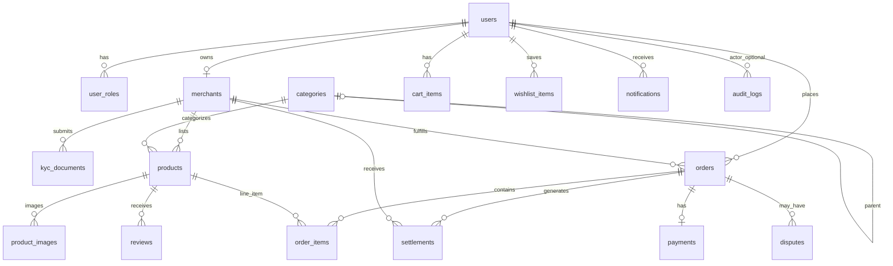

# ATOMA Pay Marketplace — PostgreSQL Database Schema

**Audience:** Technical and business stakeholders  
**Database:** PostgreSQL **18.4**  
**Default database name:** `atoma_marketplace` 
**Source of truth in repo:** Flyway `src/main/resources/db/migration/V1__init_schema.sql` plus JPA entity mappings under `src/main/java/com/atoma/marketplace/**/entity/`  

---

## 1. Scope and deployment note

| Layer | What it stores |
|--------|----------------|
| **PostgreSQL** | Users, merchants, catalog, orders, payments, settlements, disputes, audit trail, policies, notifications, reviews |
| **Redis** | Cache / session (not relational schema) |
| **RabbitMQ** | Async messaging (not relational schema) |

**Migration status:** Flyway **V1** creates identity, merchant, KYC, category, and product tables. The application also defines **orders, cart, wishlist, payments, settlements, disputes, audit logs, platform policies, notifications, and reviews** via JPA. In **production**, Hibernate is set to `ddl-auto: validate` (schema must match entities). A follow-up Flyway migration should add the remaining tables before prod deploy; the definitions in **Section 4** match the current application model.

**Naming:** Application columns use **snake_case** in PostgreSQL (e.g. `password_hash`, `created_at`). Primary keys are **UUID**. Timestamps are audit fields on almost every business table (`created_at`, `updated_at`).

---

## 2. Entity relationship overview



---

## 3. Table catalog (summary)

| Table | Purpose |
|-------|---------|
| `users` | Marketplace accounts (email, phone, profile, MFA flag) |
| `user_roles` | Many-to-many roles per user (CUSTOMER, MERCHANT, ADMIN, etc.) |
| `merchants` | Seller profile, KYC state, location, commission |
| `kyc_documents` | Uploaded compliance documents per merchant |
| `categories` | Hierarchical product taxonomy |
| `products` | Product listings, pricing, stock, approval status |
| `product_images` | Image URLs per product (collection table) |
| `cart_items` | Customer shopping cart lines |
| `wishlist_items` | Saved products (unique per customer + product) |
| `orders` | Order header, totals, delivery, lifecycle status |
| `order_items` | Line items on an order |
| `payments` | Wallet payment / escrow per order |
| `settlements` | Platform commission vs merchant net per order |
| `disputes` | Refund / dispute cases tied to orders |
| `audit_logs` | Admin and system action trail |
| `platform_policies` | Key/value operational rules (versioned) |
| `notifications` | In-app and multi-channel alerts |
| `reviews` | Product / merchant / delivery ratings |

---

## 4. Table definitions

### 4.1 Identity — `users`, `user_roles`

**`users`** (Flyway V1)

| Column | Type | Constraints | Description |
|--------|------|-------------|-------------|
| `id` | UUID | PK | Surrogate key |
| `created_at` | TIMESTAMP | NOT NULL | Record created (UTC in app) |
| `updated_at` | TIMESTAMP | NOT NULL | Last update |
| `email` | VARCHAR(120) | NOT NULL, UNIQUE | Login / contact |
| `phone` | VARCHAR(20) | NOT NULL, UNIQUE | Login / contact |
| `password_hash` | VARCHAR(255) | NOT NULL | Hashed credential |
| `first_name` | VARCHAR(100) | NOT NULL | |
| `last_name` | VARCHAR(100) | NOT NULL | |
| `status` | VARCHAR(20) | NOT NULL | See **UserStatus** |
| `mfa_enabled` | BOOLEAN | NOT NULL, DEFAULT FALSE | MFA flag |
| `profile_image_url` | VARCHAR(512) | NULL | Optional avatar URL |

**`user_roles`**

| Column | Type | Constraints |
|--------|------|-------------|
| `user_id` | UUID | PK (part), FK → `users(id)` |
| `role` | VARCHAR(20) | PK (part), NOT NULL |

---

### 4.2 Merchants — `merchants`, `kyc_documents`

**`merchants`** (Flyway V1)

| Column | Type | Constraints | Description |
|--------|------|-------------|-------------|
| `id` | UUID | PK | |
| `created_at`, `updated_at` | TIMESTAMP | NOT NULL | |
| `owner_user_id` | UUID | NOT NULL, UNIQUE, FK → `users(id)` | One merchant per owner user |
| `business_name` | VARCHAR(200) | NOT NULL | |
| `description` | VARCHAR(500) | NULL | |
| `tin_number` | VARCHAR(100) | NOT NULL | Tax ID |
| `business_license_number` | VARCHAR(100) | NULL | |
| `status` | VARCHAR(30) | NOT NULL | **MerchantStatus** |
| `kyc_status` | VARCHAR(30) | NOT NULL | **KycStatus** |
| `latitude`, `longitude` | NUMERIC(10,7) | NULL | Geo |
| `address` | VARCHAR(500) | NULL | |
| `city` | VARCHAR(100) | NULL | |
| `risk_score` | VARCHAR(20) | NULL | |
| `commission_rate` | NUMERIC(5,2) | NOT NULL, DEFAULT 5.00 | Platform % |
| `provisional_active` | BOOLEAN | NOT NULL, DEFAULT FALSE | Limited selling before full KYC |

**`kyc_documents`**

| Column | Type | Constraints |
|--------|------|-------------|
| `id` | UUID | PK |
| `created_at`, `updated_at` | TIMESTAMP | NOT NULL |
| `merchant_id` | UUID | NOT NULL, FK → `merchants(id)` |
| `document_type` | VARCHAR(50) | NOT NULL |
| `file_url` | VARCHAR(500) | NOT NULL |
| `review_status` | VARCHAR(30) | NOT NULL |
| `review_notes` | VARCHAR(500) | NULL |

---

### 4.3 Catalog — `categories`, `products`, `product_images`

**`categories`**

| Column | Type | Constraints |
|--------|------|-------------|
| `id` | UUID | PK |
| `created_at`, `updated_at` | TIMESTAMP | NOT NULL |
| `name` | VARCHAR(150) | NOT NULL, UNIQUE |
| `slug` | VARCHAR(150) | NOT NULL, UNIQUE |
| `description` | VARCHAR(500) | NULL |
| `parent_id` | UUID | NULL, FK → `categories(id)` |
| `active` | BOOLEAN | NOT NULL, DEFAULT TRUE |
| `sort_order` | INT | NOT NULL, DEFAULT 0 |
| `commission_rate` | NUMERIC(5,2) | NULL | Optional category override |

**`products`**

| Column | Type | Constraints |
|--------|------|-------------|
| `id` | UUID | PK |
| `created_at`, `updated_at` | TIMESTAMP | NOT NULL |
| `merchant_id` | UUID | NOT NULL, FK → `merchants(id)` |
| `category_id` | UUID | NOT NULL, FK → `categories(id)` |
| `title` | VARCHAR(250) | NOT NULL |
| `slug` | VARCHAR(280) | NOT NULL, UNIQUE |
| `description` | TEXT | NULL |
| `sku` | VARCHAR(100) | NOT NULL, UNIQUE |
| `price` | NUMERIC(14,2) | NOT NULL |
| `compare_at_price` | NUMERIC(14,2) | NULL |
| `stock_quantity` | INT | NOT NULL, DEFAULT 0 |
| `favorite_count` | INT | NOT NULL, DEFAULT 0 |
| `status` | VARCHAR(30) | NOT NULL | **ProductStatus** |
| `brand` | VARCHAR(100) | NULL |
| `search_vector` | VARCHAR(500) | NULL | Search helper |

**Indexes (Flyway V1):** `idx_products_status`, `idx_products_merchant`, `idx_products_category`

**`product_images`**

| Column | Type | Constraints |
|--------|------|-------------|
| `product_id` | UUID | NOT NULL, FK → `products(id)` |
| `image_url` | VARCHAR(500) | NULL |

---

### 4.4 Commerce — `cart_items`, `wishlist_items`, `orders`, `order_items`

**`cart_items`** (JPA)

| Column | Type | Constraints |
|--------|------|-------------|
| `id` | UUID | PK |
| `created_at`, `updated_at` | TIMESTAMP | NOT NULL |
| `customer_id` | UUID | NOT NULL, FK → `users(id)` |
| `product_id` | UUID | NOT NULL, FK → `products(id)` |
| `quantity` | INT | NOT NULL |
| `variant_label` | VARCHAR(100) | NULL |

**`wishlist_items`**

| Column | Type | Constraints |
|--------|------|-------------|
| `id` | UUID | PK |
| `created_at`, `updated_at` | TIMESTAMP | NOT NULL |
| `customer_id` | UUID | NOT NULL, FK → `users(id)` |
| `product_id` | UUID | NOT NULL, FK → `products(id)` |

**Unique:** (`customer_id`, `product_id`)

**`orders`**

| Column | Type | Constraints |
|--------|------|-------------|
| `id` | UUID | PK |
| `created_at`, `updated_at` | TIMESTAMP | NOT NULL |
| `order_number` | VARCHAR(30) | NOT NULL, UNIQUE | Human-readable reference |
| `customer_id` | UUID | NOT NULL, FK → `users(id)` |
| `merchant_id` | UUID | NOT NULL, FK → `merchants(id)` |
| `status` | VARCHAR(30) | NOT NULL | **OrderStatus** |
| `subtotal` | NUMERIC(14,2) | NOT NULL |
| `tax_amount` | NUMERIC(14,2) | NOT NULL, DEFAULT 0 |
| `delivery_fee` | NUMERIC(14,2) | NOT NULL, DEFAULT 0 |
| `discount_amount` | NUMERIC(14,2) | NOT NULL, DEFAULT 0 |
| `total_amount` | NUMERIC(14,2) | NOT NULL |
| `coupon_code` | VARCHAR(50) | NULL |
| `delivery_address` | VARCHAR(500) | NULL |
| `tracking_number` | VARCHAR(100) | NULL |
| `courier_name` | VARCHAR(100) | NULL |
| `payment_retry_count` | INT | NOT NULL, DEFAULT 0 |

**`order_items`**

| Column | Type | Constraints |
|--------|------|-------------|
| `id` | UUID | PK |
| `created_at`, `updated_at` | TIMESTAMP | NOT NULL |
| `order_id` | UUID | NOT NULL, FK → `orders(id)` |
| `product_id` | UUID | NOT NULL, FK → `products(id)` |
| `quantity` | INT | NOT NULL |
| `unit_price` | NUMERIC(14,2) | NOT NULL | Price at checkout |
| `line_total` | NUMERIC(14,2) | NOT NULL |
| `variant_label` | VARCHAR(100) | NULL |

---

### 4.5 Payments — `payments`, `settlements`

**`payments`**

| Column | Type | Constraints |
|--------|------|-------------|
| `id` | UUID | PK |
| `created_at`, `updated_at` | TIMESTAMP | NOT NULL |
| `order_id` | UUID | NOT NULL, UNIQUE, FK → `orders(id)` | One payment per order |
| `transaction_ref` | VARCHAR(100) | NOT NULL, UNIQUE | Internal reference |
| `wallet_transaction_id` | VARCHAR(100) | NULL | ATOMA Pay wallet ID |
| `status` | VARCHAR(30) | NOT NULL | **PaymentStatus** |
| `amount` | NUMERIC(14,2) | NOT NULL |
| `escrow_held` | BOOLEAN | NOT NULL, DEFAULT TRUE |
| `failure_reason` | VARCHAR(500) | NULL |
| `retry_attempts` | INT | NOT NULL, DEFAULT 0 |

**`settlements`**

| Column | Type | Constraints |
|--------|------|-------------|
| `id` | UUID | PK |
| `created_at`, `updated_at` | TIMESTAMP | NOT NULL |
| `merchant_id` | UUID | NOT NULL, FK → `merchants(id)` |
| `order_id` | UUID | NOT NULL, FK → `orders(id)` |
| `gross_amount` | NUMERIC(14,2) | NOT NULL |
| `platform_commission` | NUMERIC(14,2) | NOT NULL |
| `merchant_net_amount` | NUMERIC(14,2) | NOT NULL |
| `status` | VARCHAR(30) | NOT NULL | **SettlementStatus** |
| `wallet_settlement_ref` | VARCHAR(100) | NULL |

---

### 4.6 Compliance and admin — `disputes`, `audit_logs`, `platform_policies`

**`disputes`**

| Column | Type | Constraints |
|--------|------|-------------|
| `id` | UUID | PK |
| `created_at`, `updated_at` | TIMESTAMP | NOT NULL |
| `order_id` | UUID | NOT NULL, FK → `orders(id)` |
| `customer_id` | UUID | NOT NULL, FK → `users(id)` |
| `merchant_id` | UUID | NOT NULL, FK → `merchants(id)` |
| `status` | VARCHAR(30) | NOT NULL | **DisputeStatus** |
| `reason` | VARCHAR(100) | NOT NULL |
| `description` | TEXT | NULL |
| `resolution_notes` | TEXT | NULL |
| `sla_due_at` | TIMESTAMP | NULL |

**`audit_logs`**

| Column | Type | Constraints |
|--------|------|-------------|
| `id` | UUID | PK |
| `created_at`, `updated_at` | TIMESTAMP | NOT NULL |
| `actor_user_id` | UUID | NULL, FK → `users(id)` |
| `action` | VARCHAR(100) | NOT NULL |
| `entity_type` | VARCHAR(100) | NOT NULL |
| `entity_id` | VARCHAR(100) | NULL |
| `details` | TEXT | NULL |

**`platform_policies`**

| Column | Type | Constraints |
|--------|------|-------------|
| `id` | UUID | PK |
| `created_at`, `updated_at` | TIMESTAMP | NOT NULL |
| `policy_key` | VARCHAR(100) | NOT NULL, UNIQUE |
| `policy_value` | TEXT | NOT NULL |
| `version` | INT | NOT NULL, DEFAULT 1 |
| `active` | BOOLEAN | NOT NULL, DEFAULT TRUE |
| `description` | VARCHAR(500) | NULL |

---

### 4.7 Engagement — `notifications`, `reviews`

**`notifications`**

| Column | Type | Constraints |
|--------|------|-------------|
| `id` | UUID | PK |
| `created_at`, `updated_at` | TIMESTAMP | NOT NULL |
| `user_id` | UUID | NOT NULL, FK → `users(id)` |
| `type` | VARCHAR(40) | NOT NULL | **NotificationType** |
| `channel` | VARCHAR(20) | NOT NULL | **NotificationChannel** |
| `title` | VARCHAR(200) | NOT NULL |
| `message` | TEXT | NOT NULL |
| `read` | BOOLEAN | NOT NULL, DEFAULT FALSE |
| `metadata_json` | VARCHAR(500) | NULL |

**`reviews`**

| Column | Type | Constraints |
|--------|------|-------------|
| `id` | UUID | PK |
| `created_at`, `updated_at` | TIMESTAMP | NOT NULL |
| `product_id` | UUID | NOT NULL, FK → `products(id)` |
| `customer_id` | UUID | NOT NULL, FK → `users(id)` |
| `merchant_id` | UUID | NULL, FK → `merchants(id)` |
| `product_rating` | INT | NOT NULL |
| `merchant_rating` | INT | NULL |
| `delivery_rating` | INT | NULL |
| `comment` | TEXT | NULL |
| `moderated` | BOOLEAN | NOT NULL, DEFAULT FALSE |
| `approved` | BOOLEAN | NOT NULL, DEFAULT FALSE |

---

## 5. Enumerated values (stored as VARCHAR)

| Enum | Values |
|------|--------|
| **UserRole** | CUSTOMER, MERCHANT, ADMIN, AGENT, SUPPORT |
| **UserStatus** | PENDING, ACTIVE, SUSPENDED, DEACTIVATED |
| **MerchantStatus** | DRAFT, PENDING_KYC, PROVISIONAL, VERIFIED, SUSPENDED, REJECTED |
| **KycStatus** | NOT_STARTED, SUBMITTED, UNDER_REVIEW, APPROVED, REJECTED, ESCALATED |
| **ProductStatus** | DRAFT, PENDING_APPROVAL, ACTIVE, INACTIVE, REJECTED |
| **OrderStatus** | PLACED, PAYMENT_PENDING, PAYMENT_FAILED, CONFIRMED, PROCESSING, SHIPPED, OUT_FOR_DELIVERY, DELIVERED, CANCELLED, RETURN_REQUESTED, RETURNED, REFUNDED |
| **PaymentStatus** | PENDING, AUTHORIZED, CAPTURED, HELD, SETTLED, FAILED, REFUNDED, REVERSED |
| **SettlementStatus** | PENDING, PROCESSING, COMPLETED, FAILED |
| **DisputeStatus** | OPEN, UNDER_REVIEW, EVIDENCE_REQUESTED, RESOLVED, ESCALATED, CLOSED |
| **NotificationType** | ORDER_PLACED, PAYMENT_CONFIRMED, PAYMENT_FAILED, ORDER_SHIPPED, OUT_FOR_DELIVERY, DELIVERED, LOW_INVENTORY, SETTLEMENT, DISPUTE, KYC_UPDATE, PROMOTION |
| **NotificationChannel** | PUSH, SMS, EMAIL, IN_APP |

---

## 6. Consolidated DDL reference

**Already applied by Flyway V1:** see `src/main/resources/db/migration/V1__init_schema.sql`.

**Application tables (recommended Flyway V2)** — aligned with JPA entities:

```sql
-- ATOMA Pay Marketplace - Extended Schema (JPA-aligned)
-- PostgreSQL 18.4

CREATE TABLE IF NOT EXISTS cart_items (
    id UUID PRIMARY KEY,
    created_at TIMESTAMP NOT NULL,
    updated_at TIMESTAMP NOT NULL,
    customer_id UUID NOT NULL REFERENCES users(id),
    product_id UUID NOT NULL REFERENCES products(id),
    quantity INT NOT NULL,
    variant_label VARCHAR(100)
);

CREATE TABLE IF NOT EXISTS wishlist_items (
    id UUID PRIMARY KEY,
    created_at TIMESTAMP NOT NULL,
    updated_at TIMESTAMP NOT NULL,
    customer_id UUID NOT NULL REFERENCES users(id),
    product_id UUID NOT NULL REFERENCES products(id),
    UNIQUE (customer_id, product_id)
);

CREATE TABLE IF NOT EXISTS orders (
    id UUID PRIMARY KEY,
    created_at TIMESTAMP NOT NULL,
    updated_at TIMESTAMP NOT NULL,
    order_number VARCHAR(30) NOT NULL UNIQUE,
    customer_id UUID NOT NULL REFERENCES users(id),
    merchant_id UUID NOT NULL REFERENCES merchants(id),
    status VARCHAR(30) NOT NULL,
    subtotal NUMERIC(14,2) NOT NULL,
    tax_amount NUMERIC(14,2) NOT NULL DEFAULT 0,
    delivery_fee NUMERIC(14,2) NOT NULL DEFAULT 0,
    discount_amount NUMERIC(14,2) NOT NULL DEFAULT 0,
    total_amount NUMERIC(14,2) NOT NULL,
    coupon_code VARCHAR(50),
    delivery_address VARCHAR(500),
    tracking_number VARCHAR(100),
    courier_name VARCHAR(100),
    payment_retry_count INT NOT NULL DEFAULT 0
);

CREATE TABLE IF NOT EXISTS order_items (
    id UUID PRIMARY KEY,
    created_at TIMESTAMP NOT NULL,
    updated_at TIMESTAMP NOT NULL,
    order_id UUID NOT NULL REFERENCES orders(id),
    product_id UUID NOT NULL REFERENCES products(id),
    quantity INT NOT NULL,
    unit_price NUMERIC(14,2) NOT NULL,
    line_total NUMERIC(14,2) NOT NULL,
    variant_label VARCHAR(100)
);

CREATE TABLE IF NOT EXISTS payments (
    id UUID PRIMARY KEY,
    created_at TIMESTAMP NOT NULL,
    updated_at TIMESTAMP NOT NULL,
    order_id UUID NOT NULL UNIQUE REFERENCES orders(id),
    transaction_ref VARCHAR(100) NOT NULL UNIQUE,
    wallet_transaction_id VARCHAR(100),
    status VARCHAR(30) NOT NULL,
    amount NUMERIC(14,2) NOT NULL,
    escrow_held BOOLEAN NOT NULL DEFAULT TRUE,
    failure_reason VARCHAR(500),
    retry_attempts INT NOT NULL DEFAULT 0
);

CREATE TABLE IF NOT EXISTS settlements (
    id UUID PRIMARY KEY,
    created_at TIMESTAMP NOT NULL,
    updated_at TIMESTAMP NOT NULL,
    merchant_id UUID NOT NULL REFERENCES merchants(id),
    order_id UUID NOT NULL REFERENCES orders(id),
    gross_amount NUMERIC(14,2) NOT NULL,
    platform_commission NUMERIC(14,2) NOT NULL,
    merchant_net_amount NUMERIC(14,2) NOT NULL,
    status VARCHAR(30) NOT NULL,
    wallet_settlement_ref VARCHAR(100)
);

CREATE TABLE IF NOT EXISTS disputes (
    id UUID PRIMARY KEY,
    created_at TIMESTAMP NOT NULL,
    updated_at TIMESTAMP NOT NULL,
    order_id UUID NOT NULL REFERENCES orders(id),
    customer_id UUID NOT NULL REFERENCES users(id),
    merchant_id UUID NOT NULL REFERENCES merchants(id),
    status VARCHAR(30) NOT NULL,
    reason VARCHAR(100) NOT NULL,
    description TEXT,
    resolution_notes TEXT,
    sla_due_at TIMESTAMP
);

CREATE TABLE IF NOT EXISTS audit_logs (
    id UUID PRIMARY KEY,
    created_at TIMESTAMP NOT NULL,
    updated_at TIMESTAMP NOT NULL,
    actor_user_id UUID REFERENCES users(id),
    action VARCHAR(100) NOT NULL,
    entity_type VARCHAR(100) NOT NULL,
    entity_id VARCHAR(100),
    details TEXT
);

CREATE TABLE IF NOT EXISTS platform_policies (
    id UUID PRIMARY KEY,
    created_at TIMESTAMP NOT NULL,
    updated_at TIMESTAMP NOT NULL,
    policy_key VARCHAR(100) NOT NULL UNIQUE,
    policy_value TEXT NOT NULL,
    version INT NOT NULL DEFAULT 1,
    active BOOLEAN NOT NULL DEFAULT TRUE,
    description VARCHAR(500)
);

CREATE TABLE IF NOT EXISTS notifications (
    id UUID PRIMARY KEY,
    created_at TIMESTAMP NOT NULL,
    updated_at TIMESTAMP NOT NULL,
    user_id UUID NOT NULL REFERENCES users(id),
    type VARCHAR(40) NOT NULL,
    channel VARCHAR(20) NOT NULL,
    title VARCHAR(200) NOT NULL,
    message TEXT NOT NULL,
    read BOOLEAN NOT NULL DEFAULT FALSE,
    metadata_json VARCHAR(500)
);

CREATE TABLE IF NOT EXISTS reviews (
    id UUID PRIMARY KEY,
    created_at TIMESTAMP NOT NULL,
    updated_at TIMESTAMP NOT NULL,
    product_id UUID NOT NULL REFERENCES products(id),
    customer_id UUID NOT NULL REFERENCES users(id),
    merchant_id UUID REFERENCES merchants(id),
    product_rating INT NOT NULL,
    merchant_rating INT,
    delivery_rating INT,
    comment TEXT,
    moderated BOOLEAN NOT NULL DEFAULT FALSE,
    approved BOOLEAN NOT NULL DEFAULT FALSE
);

CREATE INDEX IF NOT EXISTS idx_orders_customer ON orders(customer_id);
CREATE INDEX IF NOT EXISTS idx_orders_merchant ON orders(merchant_id);
CREATE INDEX IF NOT EXISTS idx_orders_status ON orders(status);
CREATE INDEX IF NOT EXISTS idx_payments_status ON payments(status);
CREATE INDEX IF NOT EXISTS idx_notifications_user ON notifications(user_id);
```

---

## 7. Connection defaults (local / Docker)

| Setting | Default |
|---------|---------|
| Host | `localhost` |
| Port | `5432` |
| Database | `atoma_marketplace` |
| User | `atoma` |
| Password | `atoma` |

---

